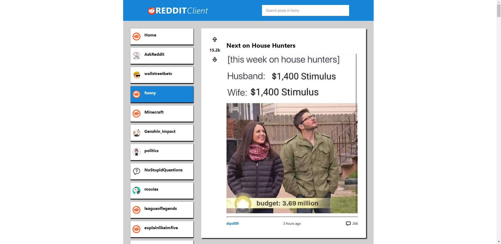

# Reddit Client

**React-Redux Codecademy Project**

---

## Project Requirements:

- Build the application using React and Redux
- Version control your application with Git and host the repository on GitHub
- Use a project management tool (GitHub Projects, Trello, etc.) to plan your work
- Write a README (using Markdown) that documents your project including:
    - Wireframes
    - Technologies used
    - Features
    - Future work
- Write unit tests for your components using Jest and Enzyme
- Write end-to-end tests for your application
- Users can use the application on any device (desktop to mobile)
- Users can use the application on any modern browser
- Users can access your application at a URL
- Users see an initial view of the data when first visiting the app
- Users can search the data using terms
- Users can filter the data based on categories that are predefined
- Users are shown a detail view (modal or new page/route) when they select an item
- Users are delighted with a cohesive design system
- Users are delighted with animations and transitions
- Users are able to leave an error state

---

## Prerequisites:

- HTML
- CSS
- JavaScript
- React
- Redux
- Jest, Enzyme, and Selenium
- Git and GitHub
- Command line and file navigation
- Wireframing

---

This project was bootstrapped with [Create React App](https://github.com/facebook/create-react-app), using the [Redux](https://redux.js.org/) and [Redux Toolkit](https://redux-toolkit.js.org/) template.

## Available Scripts

In the project directory, you can run:

### `yarn`

To install all the dependencies. 
### `yarn start`

Runs the app in the development mode. 
Open [http://localhost:3000](http://localhost:3000) to view it in the browser.

The page will reload if you make edits. 
You will also see any lint errors in the console.

### `yarn test`

Launches the test runner in the interactive watch mode. 
See the section about [running tests](https://facebook.github.io/create-react-app/docs/running-tests) for more information.
